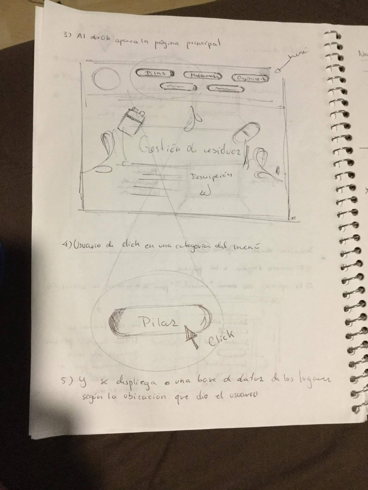

# Equipo 5:  Gestión de residuos

Página Web dónde podrás encontrar información referente a lugares a dónde llevar residuos como medicinas, pilas, desperdicios electrónicos 

## ¿A quién va dirigida esta solución?
- Personas que deseen deshacerse de sus residuos
- Compañías que se dediquen a la recolección, manejo y reuso de residuos

 
## ¿Cómo funciona?

Se te hará un serie de preguntas: 

Antes de comenzar, por favor revisa las [las instrucciones](INSTRUCTIONS.md).

